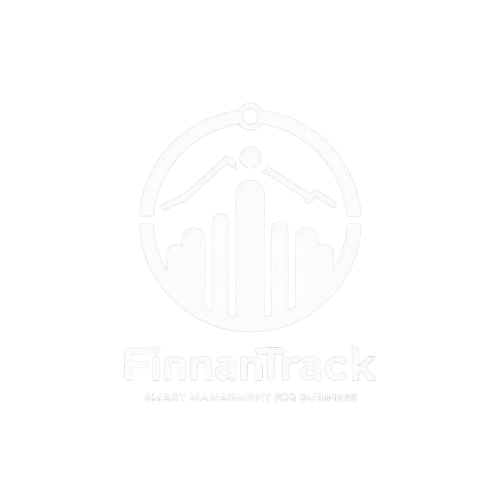

<div align="center">

  <div style="margin-top: 20px;">
    
    <span style="font-size: 2rem; margin: 0 10px;">+</span>
    
  </div>

  <div style="margin-top: 20px;">
    
    
  </div>

  <h1 style="margin-top: 20px;">Finnantrack - Smart management for business</h1> 
   
  
 [](https://github.com/brayanalmengor04) Developed by [brayanalmengor04](https://github.com/brayanalmengor04)

</div>

## ¿ De que trata el proyecto ? 
**FINNANTRACK** es una app para pequeños negocios, enfocada en la administración general y la facturación electrónica. El software será una solución integral para la gestión de clientes, ventas, inventario, reportes financieros y facturación electrónica según las regulaciones fiscales del país objetivo. 

Aquí te dejo un ejemplo de **README.md** profesional y bien estructurado que integra tu enlace de Figma:

---

# Figma Track - APP

## Visión General

Bienvenido al repositorio de **Figma Track - APP**. Este proyecto está diseñado para ofrecer una experiencia de usuario intuitiva y moderna, combinando estética y funcionalidad en cada pantalla. El objetivo es crear una interfaz limpia, organizada y profesional que facilite tanto la navegación como el desarrollo.

Aquí tienes una versión actualizada del README que integra de manera impactante el banner de Finnan Track:

---

## 🖼️ Diseño en Figma (Diseñando...)
El diseño completo de la aplicación ha sido creado en Figma. Puedes explorarlo en detalle a través del siguiente enlace:  

 

[Ver diseño en Figma](https://www.figma.com/design/PEFyoQa1qpZQTp9e2I3zsd/Figma-Track---APP?node-id=0-1&t=pgsnYmnuuh761UD8-1)
> **Nota:** Si no tienes una cuenta en Figma, regístrate para acceder a todas las funcionalidades y detalles del diseño.


---
## Tecnologías Utilizadas
- **Electron:** Framework para construir aplicaciones de escritorio multiplataforma.
-  **React:** Biblioteca de JavaScript para crear interfaces de usuario dinámicas.
-  **TailwindCSS:** Framework CSS para diseños modernos y responsivos.
-  **JavaScript:** El motor que impulsa la funcionalidad de la aplicación.
-  **Spring Boot:** Utilizaremos Spring Boot para la creación del backend.
---

- [Características](#características)
  - [1. Módulo de Administración General](#1-módulo-de-administración-general)
  - [2. Facturación Electrónica](#2-facturación-electrónica)
  - [3. Punto de Venta (POS)](#3-punto-de-venta-pos)
  - [4. Reportes y Estadísticas](#4-reportes-y-estadísticas)
- [Instalación](#instalación)
- [Uso](#uso)
- [Contribuciones](#contribuciones)
- [Licencia](#licencia)
- [Contacto](#contacto)

 
## Características
### Módulo de Administración General
- **Gestión de clientes y proveedores:**  
  Administra datos, historial de compras y facturas, manteniendo toda la información organizada y accesible.
- **Gestión de productos y stock:**  
  Se podra Controlar el inventario con alertas en tiempo real para niveles de stock bajo, asegurando una operación continua.
- **Control de ingresos y egresos :**  
  Lleva un seguimiento detallado de las finanzas de tu negocio para una gestión eficiente.
-- **Mas..**  

### Facturación Electrónica 
- **Generación de facturas:**  
  Crea facturas en formato XML/PDF, cumpliendo con todas las normativas fiscales vigentes.
- **Envío automático de facturas:**  
  Automatiza el proceso de envío por correo electrónico para ahorrar tiempo y reducir errores. 
- **Observacion:** 
  Al hacer un tema delicado hay que investigar sobre el tema de facturacion electronica .   

### 3. Punto de Venta (POS)
- **Interfaz rápida y amigable:**  
  Diseñada para agilizar el proceso de ventas en caja y mejorar la experiencia del usuario.
- **Impresión de tickets:**  
  Compatible con impresoras térmicas para la emisión inmediata de comprobantes de pago.

### 4. Reportes y Estadísticas
- **Reportes detallados:**  
  Genera informes precisos de ventas, ingresos y gastos para un análisis exhaustivo.
- **Análisis de clientes y productos:**  
  Identifica a los clientes más importantes y los productos más vendidos, ayudando a enfocar estrategias de negocio.
- **Exportación a Excel o PDF:**  
  Facilita la exportación de datos para respaldos, análisis externo o presentaciones ejecutivas esto garantiza un controll mensual de las ventas del negocio.

### Requisitos Previos 
- **Frontend:**  
  - Node.js y npm (si se utiliza un framework JavaScript) tener siempre la version mas reciente 
  Hasta la fecha es la v22.12.0. Puedes verificarlo en :
   ```bash
    $ npm -v
    11.1.0
    $ node -v
    v22.12.0
    ```
- **Backend:**   
 Spring Boot : Yo utilizo el JDK 23 (Maven) 
 Para instalar y configurar el **Backend**, sigue las instrucciones en el siguiente repositorio:
[](https://github.com/brayanalmengor04/my-finantrack-backend)

---
¡Buena suerte y disfruta desarrollando con Finantrack! 🚀


## Estructura del Proyecto

```

└── 📁src
    └── 📁assets
        └── react.svg
    └── 📁components
    └── 📁hooks
    └── 📁pages
        └── Login.jsx
    └── 📁utils
    └── App.jsx
    └── global.css
    └── main.jsx
```

## Instalación y Ejecución

1. **Clonar el repositorio:**

   ```bash
   git clone https://github.com/brayanalmengor04/my-finnantrack-app
   cd my-finnantrack-app
   ```

2. **Instalar dependencias:**

   ```bash
   npm install
   ```

3. **Ejecutar la aplicación en modo desarrollo:**

   ```bash
   npm run dev
   ```

## Contribuciones

¡Las contribuciones son bienvenidas! Si deseas colaborar en el proyecto, sigue estos pasos:

1. **Fork y Clonar:**  
   Realiza un fork del repositorio y clónalo en tu máquina local.

2. **Crear una Rama:**  
   Antes de comenzar a trabajar, crea una nueva rama para tu funcionalidad o arreglo. Por ejemplo:

   ```bash
   $git checkout -b finnantrack/integrante  

   # Commit para una nueva funcionalidad:
    
    $git commit -m "feature: Agrega funcionalidad para gestionar usuarios"

   # Commit para corrección de errores:
    
    $git commit -m "bugfix: Corrige error en el login al validar credenciales"

    # Commit para refactorización de código:
    
    $git commit -m "refactor: Optimiza la función de renderizado del componente Dashboard"

    # Commit para corrección urgente:
    $git commit -m "hotfix: Soluciona crash en producción al cargar datos de la API"

    # Commit para actualización de documentación:
  
    $git commit -m "docs: Actualiza el README con instrucciones y ejemplos de uso"

    # Commit para tareas de mantenimiento:
   $git commit -m "chore: Actualiza dependencias y configura ESLint"

    # Commit para mejoras en la interfaz:
    $git commit -m "ui: Mejora la experiencia de usuario en la sección de perfiles"

    $git commit -m "integration: Implementa integración con API de pagos" 


   ```

3. **Verificar Actividades Pendientes en GitHub Projects:**  
   Revisa el tablero de **GitHub Projects** para conocer las tareas y actividades pendientes del proyecto. Esto te ayudará a entender en qué áreas puedes contribuir y a evitar duplicar esfuerzos.  
   - Ingresa a la pestaña **Projects** en el repositorio.
   - Examina las columnas que organizan las tareas (por ejemplo: _To Do_, _In Progress_, _Review_).
   - Elige una tarea asignada o sugiere una nueva si identificas un área de mejora.

4. **Realizar Cambios y Commits:**  
   Desarrolla tu funcionalidad, realiza commits descriptivos y frecuentes:

5. **Push y Pull Request:**  
   Envía tu rama al repositorio remoto y abre un Pull Request:

   ```bash
   git push origin feature/nueva-funcionalidad
   ```
   
   Luego, crea un Pull Request en GitHub para que el equipo pueda revisar tus cambios.

## Buenas Prácticas

- **Commit Mensajes Claros:** Asegúrate de que cada commit tenga un mensaje descriptivo que explique el cambio realizado.
- **Código Limpio:** Sigue las convenciones y estructuras ya definidas en el proyecto para mantener la coherencia.
- **Revisión de Código:** Participa activamente en las revisiones de código, ofreciendo y recibiendo feedback constructivo.
- **Actualización de Tareas:** Una vez finalizada tu tarea, actualiza el estado correspondiente en GitHub Projects para mantener un flujo de trabajo ágil.


## Licencia

Este proyecto se distribuye bajo la [Licencia MIT](LICENSE).

---


